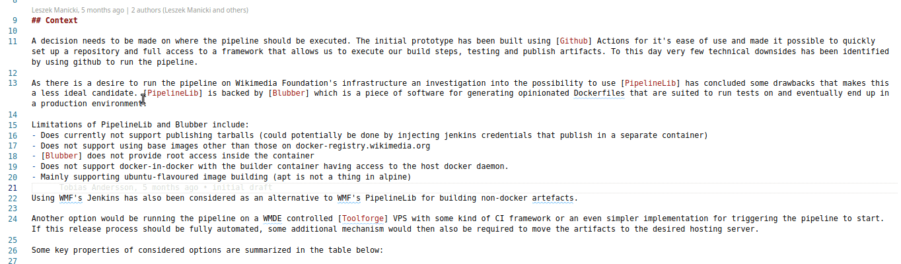

## OpenAi explains things in Visual Studio Code

Installation: 
1. You need `.env` file with API_KEY from https://beta.openai.com/
2. `npm install`
3. press F5 or export this thing somehow as an actual extension
4. Select a passage in a markdown file and click "Explain it like im stupid"
5. Wait for the slow request to replace the text